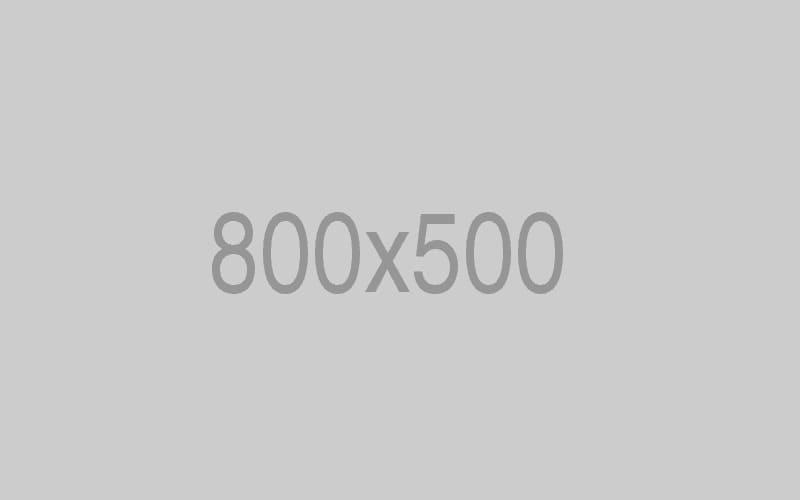
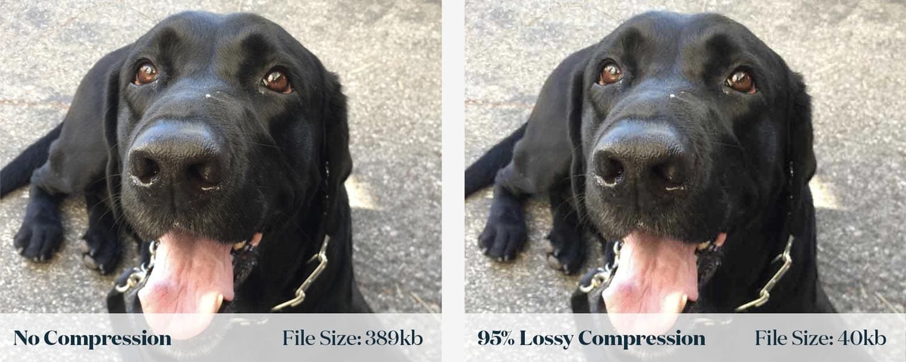
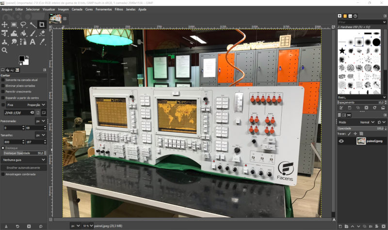
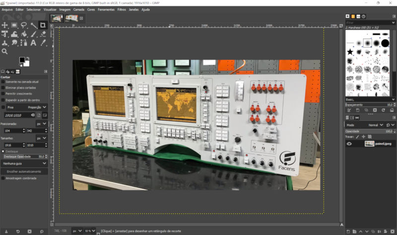
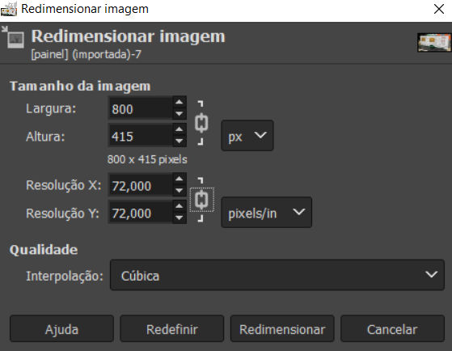
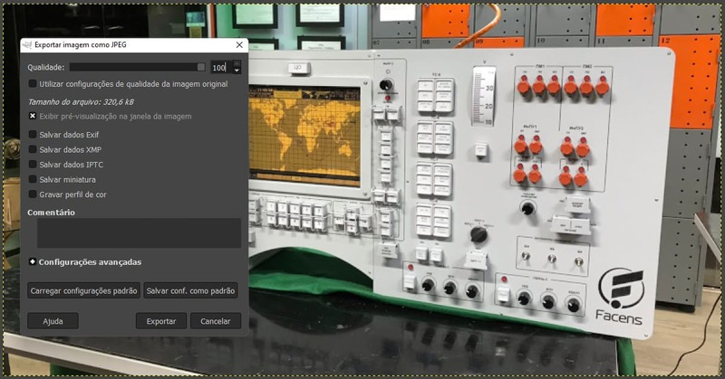
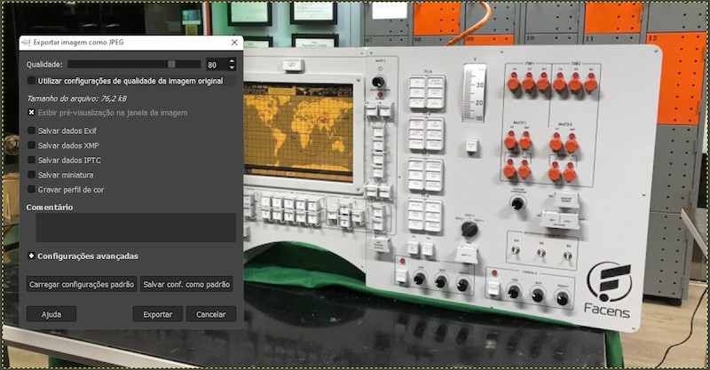

# Como preparar imagens
- Tutorial feito por: Gustavo Abreu
- Local: Fab Lab Facens
- Licença: [CC BY-SA](https://creativecommons.org/licenses/by-sa/4.0/)
- Última atualização: 04/01/2023
- Última atualização por: Gustavo Abreu


## Sumário
Você sabia que 1 segundo de espera para uma página carregar poderia custar 1.6 bilhões de dólares para a [Amazon](https://www.fastcompany.com/1825005/how-one-second-could-cost-amazon-16-billion-sales)?
 
Ninguém gosta de ficar esperando. Por isso, é muito importante se preocupar com o peso das imagens que você irá incluir no seu material. Pense que com a qualidade das câmeras de hoje em dia, as fotos pesam facilmente 4MB. Em um tutorial não tão longo, é bem comum atingir dezenas de fotos. Sem tomar cuidado, a página pode demorar vários segundos para carregar. Sem contar o peso para guardar tudo isso no servidor.

Neste tutorial você irá aprender como otimizar as imagens para web usando o [GIMP](https://www.gimp.org/). Ele é um software de edição de imagens open-source, gratuito e cheio de recursos.

Existem também várias ferramentas online gratuitas que fazem isso com bastante facilidade. Como por exemplo o [JPEG Optimizer](https://jpeg-optimizer.com/) ou [Squoosh](https://squoosh.app/).

## Recomendações

### Formato

Prefira JPEG, ele permite uma melhor compressão sem perder tanto a qualidade.
Utilize PNG apenas se fizer sentido usar o fundo da imagem transparente.

Vídeos e GIFs falamos no tutorial Como preparar vídeos e GIFs.

### Dimensões
Este site está otimizado para manter o conteúdo em aproximadamente 800px de largura. Portanto, o ideal é nunca passar disso.

Exemplo:


### Peso
A imagem acima pesa míseros 5KB. O ideal é nunca passar de 100kb, mantendo uma qualidade aceitável.

Veja no exemplo abaixo que na maioria das vezes a diferença de qualidade mal é percebível, mas o tamanho muda bastante:

<figure markdown>
  
  <figcaption>Fonte: <a href="https://www.jshaw.io/insights/the-introductory-guide-to-file-types">jshaw.io</a> </figcaption>
</figure>

### Diretório e nome

Todas as pastas de tutoriais seguem a seguinte estrutura:

```
├── como_preparar_imagens.md
├── imagens
│   └── como_preparar_imagens
│       ├── 800x500.jpg
│       └── comparação.jpeg
```

Portanto, crie sempre uma pasta com o título do seu tutorial com as letras minúsculas e separados por underline.

Para o nome, tente mantê-lo sempre simples, sem espaços e facilmente identificável. Isso vai facilitar sua vida quando precisar apontar a imagem dentro do tutorial.

Para os demais arquivos e como incluí-los nos documentos, explicamos no tutorial de Como contribuir e Como escrever em markdown.

## Otimizar imagens com o GIMP

Caso ainda não possua o GIMP, faça o [download](https://www.gimpbrasil.org/downloads) e siga os passos de instalação.

### Passo 1: Abrir sua imagem

Abra sua imagem clicando em Arquivo > Abrir ou pelo atalho Ctrl-O.




### Passo 2: Corte adequadamente

Tente sempre deixar apenas o que for relevante na imagem, bem centralizado.




### Passo 3: Redimensionar

Abra o menu Imagem > Redimensionar

Mantendo o cadeado fechado, ao colocar a largura de até 800px, a altura automaticamente se ajusta.

A resolução padrão para telas é de 72 pixels por polegada.



### Passo 4: Exportar

Clique em Arquivo > Exportar como e defina o diretório e o nome_do_arquivo.jpeg.

Ajuste a qualidade para 80%.

Desmarque todas as opções e clique em Salvar conf. como padrão. Isso só precisa ser feito uma vez.

Repare que não há diferença perceptível entre a qualidade 100% e 80%, mas o tamanho da imagem cai de 320kB para 76kB.




Pronto. Sua imagem está otimizada para ir para o site.